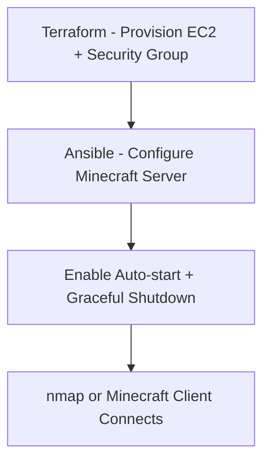

# Minecraft Server Deployment on AWS (Automated with IaC)

## Background

This project automates the deployment of a Minecraft server on AWS infrastructure using Infrastructure as Code (IaC) principles. Rather than manually provisioning and configuring the server as done in Part 1, this setup uses tools like Terraform, Ansible, and the AWS CLI to fully automate the process. The server is designed to auto-start after reboots and can be configured or redeployed consistently without ever using the AWS Management Console.

---

## Requirements

### Tools Needed
- [Terraform](https://developer.hashicorp.com/terraform/downloads) (v1.5+)
- [Ansible](https://docs.ansible.com/ansible/latest/installation_guide/intro_installation.html) (v2.14+)
- [AWS CLI](https://docs.aws.amazon.com/cli/latest/userguide/install-cliv2.html) (v2.x)
- Git
- An AWS Academy Learner Lab account with access credentials (access key, secret key, region)

### Credentials & Configuration
1. Configure your AWS CLI:
    ```bash
    aws configure
    ```
2. Ensure your IAM permissions allow EC2 instance creation and S3 (optional if using data persistence).
3. Export your AWS credentials (optional if using config file):
    ```bash
    export AWS_ACCESS_KEY_ID=your_key
    export AWS_SECRET_ACCESS_KEY=your_secret
    export AWS_DEFAULT_REGION=us-east-1
    ```

---

## Pipeline Overview



---

## How to Run This Project

### 1. Clone the Repo
```bash
git clone https://github.com/KyleWerstlein/cs312final.git
cd minecraft-server-iac
```

### 2. Provision Infrastructure with Terraform
```bash
cd terraform/
terraform init
terraform apply
```
- This sets up the EC2 instance and networking. Public IP will be displayed at the end.

### 3. Configure Minecraft with Ansible
```bash
cd ../ansible/
ansible-playbook -i inventory setup-minecraft.yml
```
- Installs Java, downloads the Minecraft server, enables the service, and ensures reboot persistence.

### 4. Connect to the Minecraft Server
Once setup is complete, use the Minecraft client or:
```bash
nmap -sV -Pn -p T:25565 <instance_public_ip>
```

---

## Notes

- The Minecraft service is configured using `systemd` and will restart on reboot.
- Terraform outputs the public IP address; no need to log into AWS manually.
- The repo does not use `user_data`, as it's disallowed in the assignment.

---

## Resources Used

- [Minecraft Server Setup Guide](https://minecraft.net/en-us/download/server)
- [Terraform AWS Provider Docs](https://registry.terraform.io/providers/hashicorp/aws/latest/docs)
- [Ansible EC2 Guide](https://docs.ansible.com/ansible/latest/scenario_guides/guide_aws.html)
- [AWS EC2 Documentation](https://docs.aws.amazon.com/ec2/index.html)

---

## Repository Structure

```
minecraft-server-iac/
├── terraform/
│   ├── main.tf
│   └── variables.tf
├── ansible/
│   ├── inventory
│   └── setup-minecraft.yml
├── scripts/ (optional)
│   └── configure.sh
└── README.md
```

---
